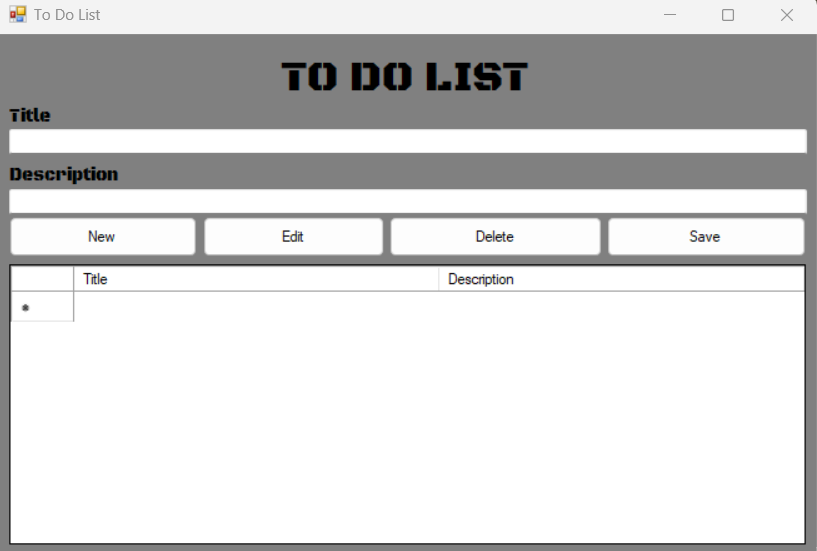

# BASIC TO-DO LIST APP

## A basic To-Do List App that let's you add, edit, save, and delete notes.

This project is a basic version of a To Do List.

- Add New notes with New button.
- Edit the notes you added with the Edit button.
- Delete the notes you added with the Delete button.
- Save the notes you want to add with the Save button.

#-Main Screen-

